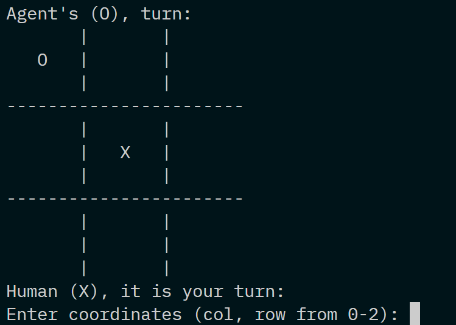

# Tic-Tac-Toe

<p align="center"></p>

Terminal-based Tic-Tac-Toe with an unbeatable AI opponent.

Written in C.

## About

The AI opponent is powered by the minimax algorithm with alpha-beta pruning.

## Setup

1. **Clone the repository:**
    ```bash
    git clone https://github.com/siddhp1/Tic-Tac-Toe.git
    cd Tic-Tac-Toe
    ```

2. **Build the project using `make`:**
    ```bash
    make
    ```

## Usage

Run the game using the following command:

```bash
./tictactoe
```

Have fun playing!

## License

This project is licensed under the MIT License.
